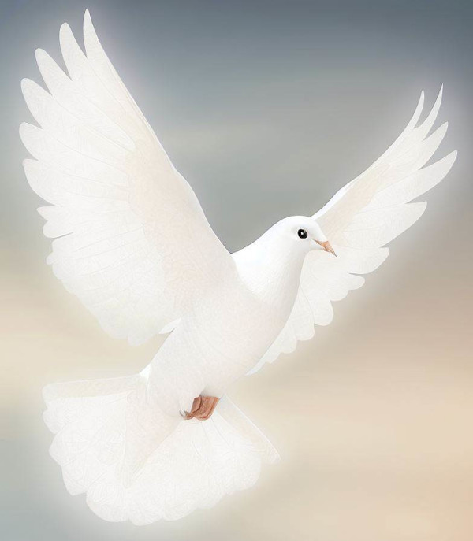

## Introduction : La Triade du Conflit

Dans l'effort constant de l'humanité pour comprendre la nature conflictuelle de notre existence, nous avons examiné diverses facettes de notre comportement et de nos interactions. Au cœur de ces réflexions, se trouvent trois facteurs interconnectés et puissants : le désir d'imposer son point de vue, la peur, et l'ego. Ces trois éléments sont souvent présents dans les conflits, qu'ils soient interpersonnels, sociaux ou internationaux.

## Le désir d'imposer son point de vue : Un Terreau pour le Conflit

Commençons par le désir d'imposer son point de vue. Ce désir est intrinsèquement lié à notre conception de nous-mêmes et du monde. Nous avons tous des convictions, des valeurs et des croyances qui façonnent notre compréhension du monde. Cependant, lorsque nous cherchons à imposer ces points de vue aux autres, nous créons un terrain propice au conflit. L'harmonie n'est possible que lorsque nous adoptons une posture d'écoute, de respect et de compréhension des perspectives d'autrui.

## Peur : Le Conducteur Invisible du Conflit

La peur, quant à elle, est un moteur puissant de comportement. Elle se manifeste dans notre anxiété face à l'inconnu, notre crainte de perdre ce que nous avons, et notre appréhension face à ce qui pourrait nous nuire. La peur peut nous pousser à agir de manière défensive ou agressive, et elle peut exacerber les conflits en nous faisant voir les autres comme des menaces plutôt que comme des partenaires potentiels pour la résolution de problèmes.

## Égo : Le Cœur de la Perception et du Conflit

Enfin, l'ego, dans le sens de l'identité de soi ou de l'estime de soi, joue un rôle clé dans les conflits. L'ego nous amène à défendre nos points de vue, nos croyances et nos valeurs de manière parfois inflexible. Il peut également nous pousser à réagir de manière défensive lorsque nous nous sentons menacés ou attaqués. C'est l'ego qui nous fait croire que nous "méritons" quelque chose ou que nous sommes "moins bien lotis". En d'autres termes, l'ego est souvent au cœur de notre perception de nous-mêmes et de notre place dans le monde.

## Interconnexions : Comprendre le Rôle de l'Égo, de la Peur et de l'Imposition dans le Conflit

Ces trois facteurs, bien qu'interconnectés, peuvent être envisagés séparément pour une meilleure compréhension de leur rôle dans les conflits. Par exemple, les différences de valeurs et d'objectifs peuvent être vues comme un sous-produit de l'ego, tandis que le stress et la pression peuvent être vus comme une manifestation de la peur. De même, les malentendus et les problèmes de communication peuvent être liés à l'ego, car c'est l'ego qui peut provoquer une réaction défensive à ce qui est perçu comme une insulte. Si l'ego était mis de côté, il y aurait plus de place pour la clarification et la compréhension mutuelle.

## Résoudre les Conflits : Un Chemin vers l'Empathie et la Communication Constructive

La reconnaissance de ces trois facteurs est une étape importante vers la résolution des conflits de manière plus constructive et empathique. En reconnaissant le rôle de l'ego, de la peur et du désir d'imposer son point de vue dans nos conflits, nous pouvons commencer à déconstruire les schémas de pensée et de comportement qui nous poussent vers l'antagonisme plutôt que vers l'harmonie. En reconnaissant le rôle de la peur, nous pouvons travailler à comprendre nos peurs et à trouver des moyens de les apaiser, plutôt que de les laisser nous pousser vers des comportements conflictuels. Et en reconnaissant le rôle du désir d'imposer notre point de vue, nous pouvons commencer à chercher des moyens de partager nos perspectives sans chercher à dominer celles des autres.

## La Résolution des Conflits en tant que Croissance Personnelle et Spirituelle

Dans cette perspective, la résolution des conflits n'est pas seulement une question de techniques de communication ou de négociation, mais aussi de développement personnel et de croissance spirituelle. C'est une opportunité pour nous d'apprendre sur nous-mêmes, sur nos peurs, nos désirs, et notre ego, et de chercher à les comprendre et à les transformer. C'est une opportunité pour nous de chercher à vivre en harmonie avec nous-mêmes et avec les autres, plutôt que d'être constamment en conflit.

## Une Nouvelle Perspective : Voir les Conflits comme des Opportunités de Croissance

En fin de compte, la clé pour résoudre les conflits réside peut-être dans la reconnaissance de notre humanité commune et de notre interconnexion. En reconnaissant que nous partageons tous les mêmes peurs, les mêmes désirs, et le même besoin d'affirmer notre ego, nous pouvons commencer à voir les conflits non pas comme des batailles à gagner, mais comme des opportunités pour grandir et pour se rapprocher les uns des autres.

## Dernières Pensées : Favoriser l'Harmonie à travers la Compréhension et la Croissance

Et peut-être que c'est là que se trouve la véritable solution aux conflits : non pas dans l'affirmation de notre ego, la domination de nos peurs, ou l'imposition de notre point de vue, mais dans l'ouverture à l'autre, l'écoute, la compassion, et la volonté de grandir et d'apprendre ensemble. Car c'est seulement en reconnaissant et en embrassant notre humanité commune que nous pourrons trouver un moyen de vivre ensemble dans la paix et l'harmonie
